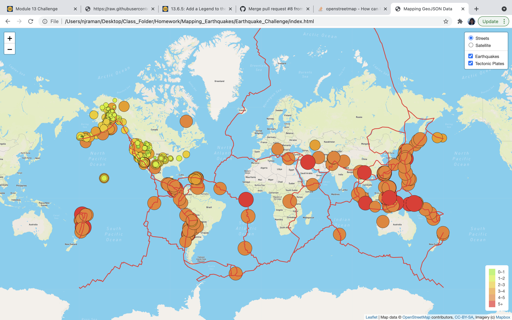
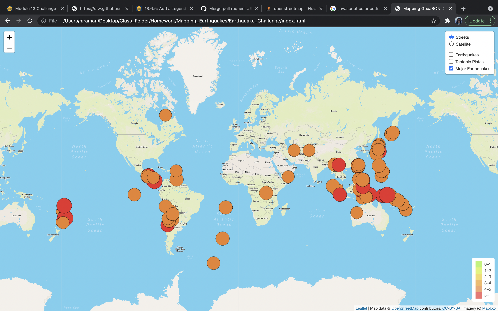
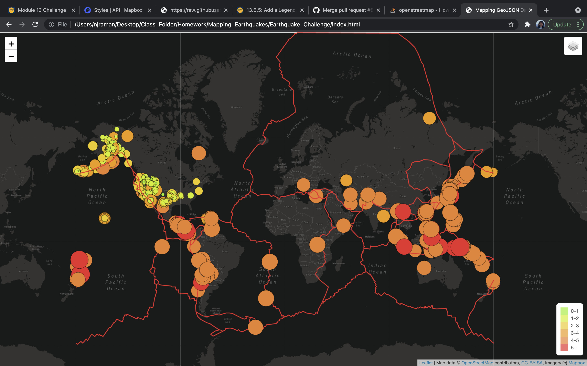
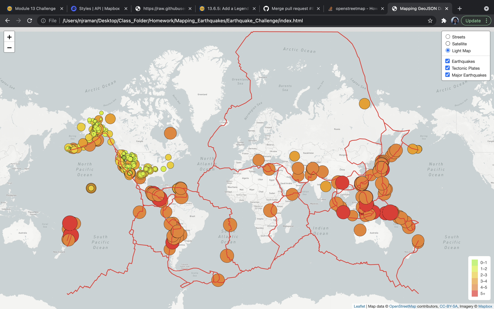

# Mapping_Earthquakes

## Objective:

The purpose of this project is to build interactive data visualizations in the form od Earthquake maps that displays earthquake related data from across the world.

In order to do this, data is extracted from the latest earthquake GeoJSON data from various sources. The data is extracted and traversed using javascript, D3, and Leaflet libraries and the data is plotted on a Mapbox map.

## Results:

The map displays Earthquake locations that are color coded according to the magnitude of the earthquake, with a legend to explain the same. The radius of the markers on the map are scaled according to the magnitude of the earthquake. 

A popup has been added to each marker that displays the magnitude and location of the earthquake. The map also displays tectonic plate information to show the different fault lines.

Four different types of tile layers have been added, which offer  different background styles for the map such as  street map, satellite map, dark map and light map. A user can choose what style and what information they want to view and the map would dynamically filter and display the same.

## Screenshots:

The following screenshots display different maps that have been created as part of this project.

### Deliverable 1: Satellite map showing tectonic plate information:

### Deliverable1: Street map showing tectonic plate information:

### Deliverable 2: Map showing major earthquakes:

### Deliverable 3: Dark map style showing all earthquake information:

### Deliverable 3: Light map stule showing all earthquake information:

